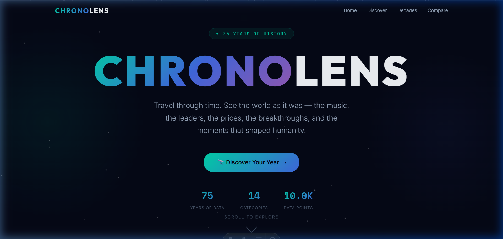
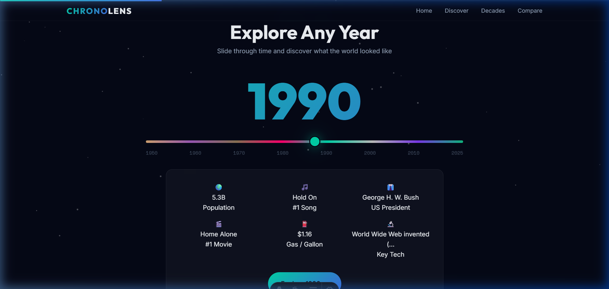
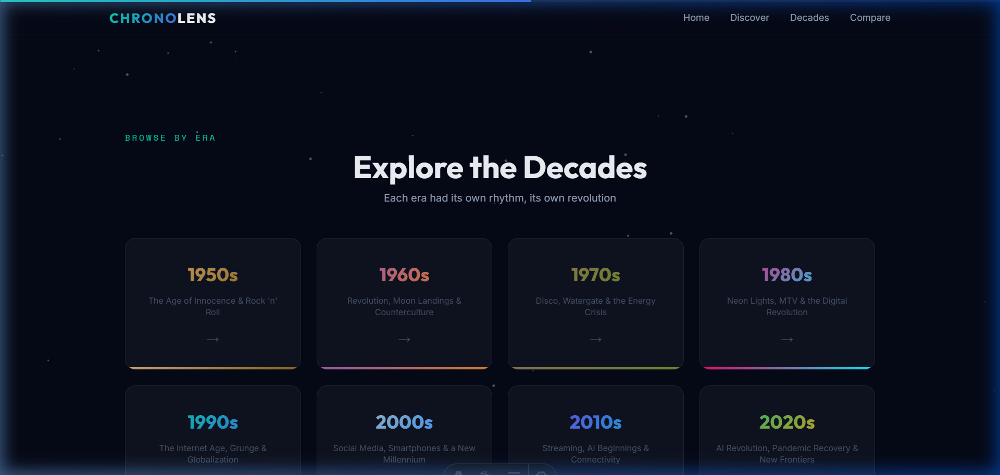
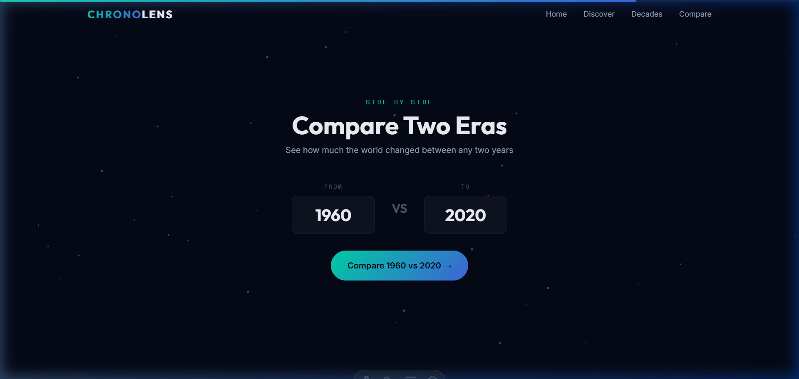

<div align="center">
  
  <h1>✨ ChronoLens ✨</h1>
  <p><strong>A Journey Through 75 Years of Human History</strong></p>
  <p><em>"Travel through time. See the world as it was."</em></p>
</div>

<br />



## 🎓 What is ChronoLens?

**ChronoLens** is an interactive web application designed to make history feel alive. Instead of reading a textbook, you can "slide" through time to see how the world changed between 1950 and 2025. 

It's a perfect project for students to learn how modern websites handle **large amounts of data** and create **smooth, interactive user interfaces**.

---

## 🌟 Features Explained

### 📅 The Year Explorer
The heart of the project. By using a simple slider, you can jump to any year. 
- **Learning Point:** This demonstrates how to use **JavaScript** to instantly update the screen (DOM) based on user input without reloading the page.



### 🕰️ Decade Collections
We grouped history into "Eras" (1950s, 60s, 70s, etc.). Each era has its own "vibe" created through color and typography.
- **Learning Point:** Shows how **CSS Variables** can be used to change the entire theme of a card dynamically.



### ⚖️ Side-by-Side Comparison
Want to see how much a gallon of gas changed from your parents' time to now? The Compare tool lets you pick two years and see the differences in society, economics, and culture.
- **Learning Point:** Teaches how to **filter and compare data** from two different sources in a JSON file.



---

## 🛠️ How it's Built (The Tech Stack)

If you're a student, here's the "secret sauce" behind ChronoLens:

1.  **[Astro 🚀](https://astro.build/):** This is the "skeleton" of the site. It's a modern framework that makes websites load incredibly fast by sending zero JavaScript to the browser unless it's absolutely needed.
2.  **Vanilla CSS:** No complex libraries like Tailwind here! We used pure CSS to build the **Glassmorphism** (that frosted glass look) and the custom animations.
3.  **JSON Data:** Instead of a complicated database, all the history (10,000+ data points!) is stored in simple `.json` files. This makes it easy for anyone to add more history just by editing a text file.
4.  **Responsive Design:** The site works on your phone, tablet, or laptop.

---

## 🚀 How to Run it Yourself

Want to see the code in action? Follow these steps:

### 1. Prerequisites
Make sure you have [Node.js](https://nodejs.org/) installed.

### 2. Setup
Open your terminal and run:
```bash
# Clone the repository
git clone https://github.com/your-username/chronolens.git

# Go into the folder
cd chronolens

# Install the "ingredients" (dependencies)
npm install
```

### 3. Launch
```bash
# Start the magic
npm run dev
```
Now open [http://localhost:4321](http://localhost:4321) in your browser!

---

## 📂 Project Roadmap (For Students)

If you want to explore the code, here is where to look:
- `src/data/years.json`: Where all the historical facts live.
- `src/pages/index.astro`: The main homepage code.
- `docs/screenshots/`: Where these cool pictures are stored.

---

## 📜 License
This project is open for everyone to learn from under the **MIT License**.
